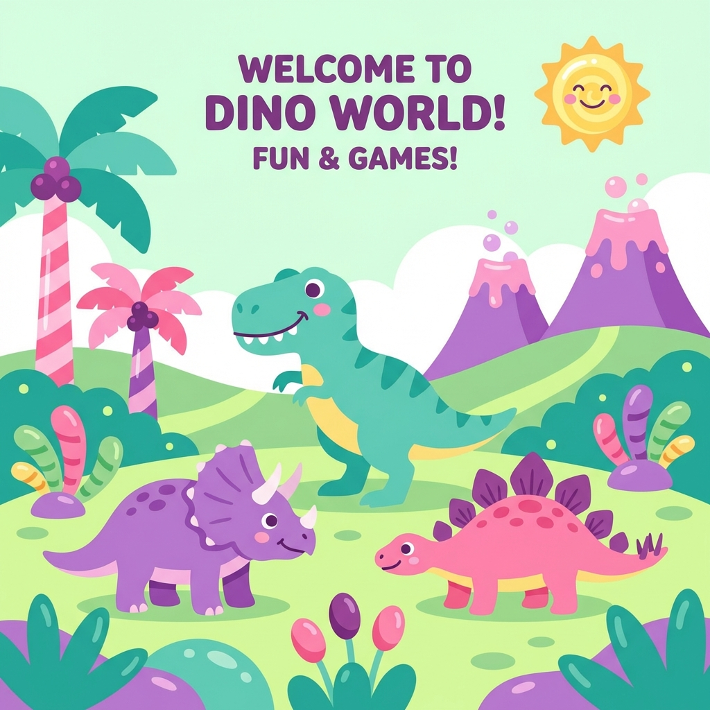

# 🦖 Dino-Mite! - Educational Dinosaur Website for Kids

<div align="center">



**A fun, animated, and educational dinosaur website designed for K4 (4-5 year old) children.**

[Live Demo](#) · [Features](#-features) · [Getting Started](#-getting-started) · [Project Structure](#-project-structure)

</div>

---

## 🎯 Overview

**Dino-Mite!** is an interactive web application that teaches young children about dinosaurs through:
- 🖼️ Cute, colorful cartoon illustrations
- 🔊 English pronunciation with North American accent
- 📖 Read-aloud functionality for each dinosaur
- 🎮 Fun vocabulary games with sound effects
- 🎵 Background music during gameplay

The website uses simple English suitable for early learners and features a vibrant, candy-colored design to engage young audiences.

---

## ✨ Features

### 🦕 Meet the Dinosaurs
Learn about **10 popular dinosaurs** with:
- High-quality cartoon illustrations
- Simple English descriptions
- Name pronunciation button (🔊)
- Era, diet, and fun facts

| Dinosaur | Nickname | Period |
|----------|----------|--------|
| Tyrannosaurus Rex | The King | Late Cretaceous |
| Triceratops | Three Horns | Late Cretaceous |
| Stegosaurus | Roof Lizard | Late Jurassic |
| Brachiosaurus | Long Neck | Late Jurassic |
| Pteranodon | The Flyer | Late Cretaceous |
| Velociraptor | Speedy Thief | Late Cretaceous |
| Ankylosaurus | The Tank | Late Cretaceous |
| Spinosaurus | Spiny Lizard | Cretaceous |
| Parasaurolophus | Trumpet Head | Late Cretaceous |
| Diplodocus | Long Tail | Late Jurassic |

### 🎮 Interactive Games

#### Dino Match!
- Match dinosaur pictures with their names
- Pronunciation buttons to learn while playing
- Sound effects for correct/wrong answers
- Victory celebration on completion

#### Dino Quiz!
- Multiple choice questions
- Visual feedback with animations
- Score tracking
- Encouraging messages for all outcomes

### 🔊 Audio Features
- **Pronunciation**: Click speaker icon to hear dinosaur names in US English
- **Read Aloud**: Full page narration on detail pages
- **Background Music**: Toggle cheerful music during games
- **Sound Effects**: Feedback sounds for game interactions

---

## 🚀 Getting Started

### Prerequisites
- Node.js 18+ 
- npm or yarn

### Installation

```bash
# Clone the repository
git clone https://github.com/corilin/dinosaurforkid.git

# Navigate to project directory
cd dinosaurforkid

# Install dependencies
npm install

# Start development server
npm run dev
```

Open [http://localhost:5173](http://localhost:5173) in your browser.

### Build for Production

```bash
npm run build
```

---

## 📁 Project Structure

```
dinomite/
├── public/                 # Static assets
├── src/
│   ├── assets/            # Dinosaur images and graphics
│   │   ├── hero_banner.png
│   │   ├── dino_trex.png
│   │   ├── dino_triceratops.png
│   │   └── ... (10 dinosaur images)
│   ├── components/        # Reusable UI components
│   │   ├── SpeakButton.jsx      # Pronunciation button
│   │   ├── MusicToggle.jsx      # Background music control
│   │   └── games/
│   │       ├── MatchingGame.jsx # Picture-name matching game
│   │       └── QuizGame.jsx     # Multiple choice quiz
│   ├── data/
│   │   └── dinosaurs.js   # Dinosaur data (names, facts, images)
│   ├── pages/             # Page components
│   │   ├── Home.jsx       # Landing page with hero
│   │   ├── DinoList.jsx   # Grid of all dinosaurs
│   │   ├── DinoDetail.jsx # Individual dinosaur info
│   │   └── Games.jsx      # Game selection hub
│   ├── utils/             # Utility functions
│   │   ├── speech.js      # Text-to-speech (Web Speech API)
│   │   ├── soundEffects.js # Game sound effects (Web Audio)
│   │   └── backgroundMusic.js # Background music manager
│   ├── App.jsx            # Main app with routing
│   ├── main.jsx           # Entry point
│   └── index.css          # Global styles + Tailwind config
├── tailwind.config.js     # Tailwind CSS configuration
├── vite.config.js         # Vite build configuration
└── package.json           # Dependencies and scripts
```

---

## 🛠️ Tech Stack

| Technology | Purpose |
|------------|---------|
| **React 19** | UI Framework |
| **Vite 7** | Build tool & dev server |
| **Tailwind CSS 4** | Styling with custom color palette |
| **Framer Motion** | Animations |
| **React Router** | Page navigation |
| **Lucide React** | Icons |
| **Web Speech API** | Text-to-speech pronunciation |
| **Web Audio API** | Sound effects & music |

---

## 🎨 Design System

### Color Palette
| Color | Hex | Usage |
|-------|-----|-------|
| Dino Pink | `#FFC1CC` | Primary buttons, accents |
| Dino Purple | `#D4C4FB` | Headers, secondary actions |
| Dino Green | `#B8E8D8` | Background tint |
| Dino Teal | `#A0E7E5` | Success states, CTAs |
| Dino Yellow | `#FBE7C6` | Highlights, speaker buttons |

### Typography
- **Headers**: Bubblegum Sans (playful, rounded)
- **Body**: Fredoka (friendly, readable)

---

## 📝 License

This project is open source and available under the [MIT License](LICENSE).

---

## 🙏 Acknowledgments

- Dinosaur illustrations generated with AI
- Inspired by the curiosity of young learners
- Built with ❤️ for K4 education

---

<div align="center">

**Made with 🦕 for little dinosaur fans everywhere!**

</div>
